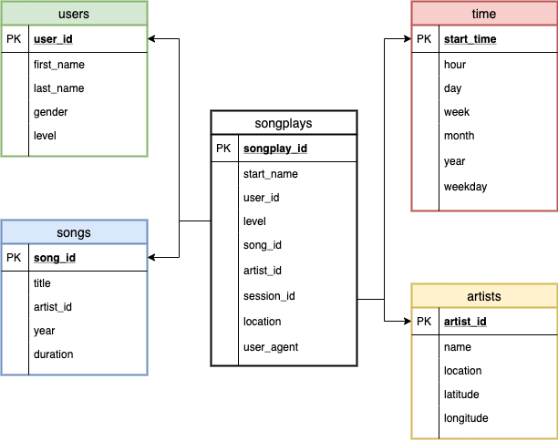

## DEND PROJECT 1: Data Modelling with PostGres

### Introduction

A startup called Sparkify wants to analyze the data they've been collecting on songs and user activity on their new music streaming app. The analytics team is particularly interested in understanding what songs users are listening to. Currently, they don't have an easy way to query their data, which resides in a directory of JSON logs on user activity on the app, as well as a directory with JSON metadata on the songs in their app. 

**Objective**
To create a database schema and ETL pipeline for this analysis. 

### Description

> **Project**
In this project, you'll apply what you've learned on data modeling with Postgres and build an ETL pipeline using Python. To complete the project, you will need to define fact and dimension tables for a star schema for a particular analytic focus, and write an ETL pipeline that transfers data from files in two local directories into these tables in Postgres using Python and SQL.

> **File**
<ul>
<li><code>test.ipynb</code> displays the first few rows of each table to check the database.</li>
<li><code>create_tables.py</code> drops and creates the tables.</li> 
<li><code>etl.ipynb</code> reads and processes a single file from song_data and log_data and loads the data into the tables.</li>
<li><code>etl.py</code> reads and processes files from song_data and log_data and loads them into the tables.</li> 
<li><code>sql_queries.py</code> contains all the sql queries, and is imported into the last three files above.</li>
</ul>

### Database Schema

<code>Star Schema</code>
**Fact table:** songplays.
**Dimension tables:** users, songs, artists, time.

### ETL pipeline

<ol>
    <list><code>create_tables.py</code> is a python script that is run in a terminal to initalize the tables in the sparkify database</list>
    <list> <code>sql_queries.py</code> contains the queries and by running <code>create_tables.py</code> , the queries are imported into <code>create_tables.py</code></list>
        <list><code>test.ipynb</code> is a notebook that, when run, allows for checking if the right tables with the appropriate columns are created</list>
    <list><code>etl.ipynb</code> is a notebook that shows how the <code>etl.py</code> script works</list>
    <list><code>etl.py</code> is a python script that is run in the terminal to process the datasets. Using the cursor object in the script to connect to Sparkify's database then extracts and processes the datasets and loads them into the tables created. <code>sql_queries.py</code> is imported into this script</list>
    <list>Make sure to run the <code>test.ipynb</code> notebook to check you've performed all the steps correctly</list>
    </ol>

### Example query

*Who are the top 5 users that listen to the most music?*
<code>SELECT user_id as user, count(*)play_count
FROM songplays 
GROUP BY user
ORDER BY COUNT(*) DESC LIMIT 5;</code>